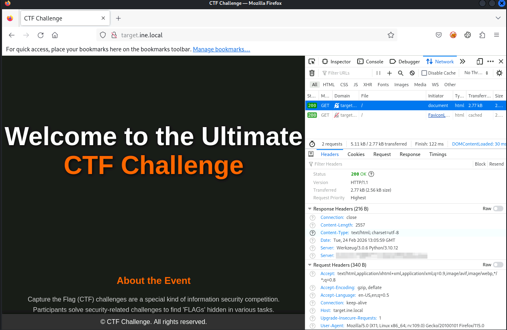
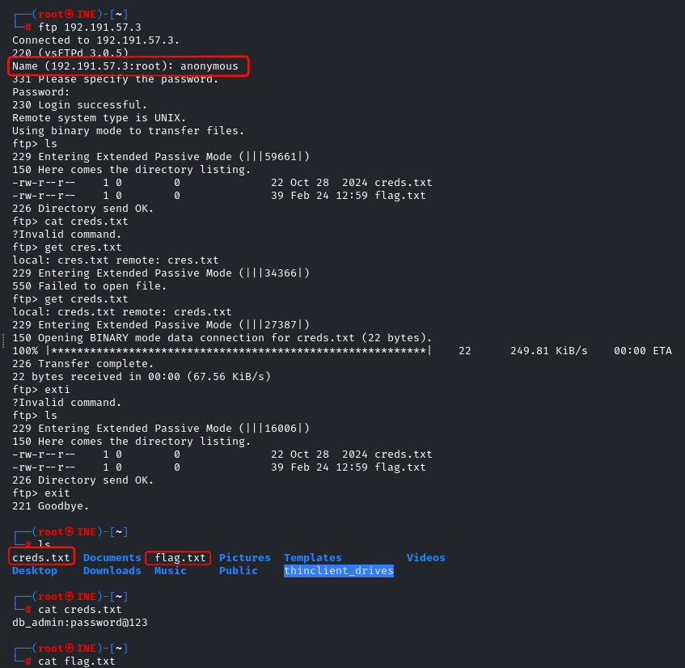
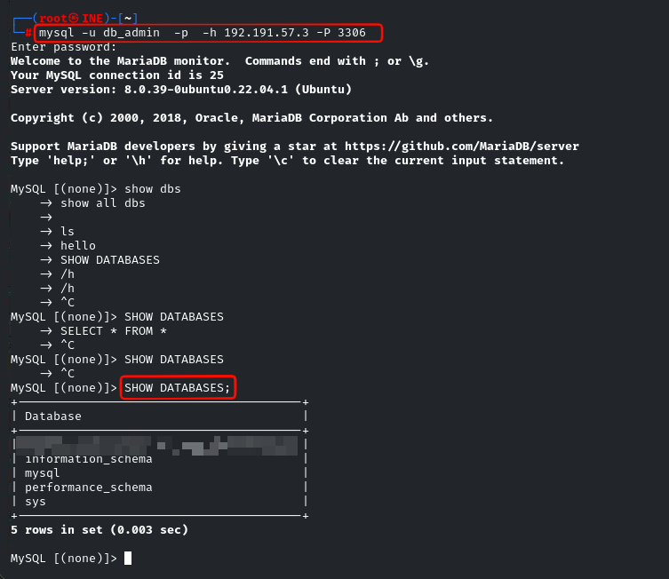

# Footprinting and Scanning

## Flag 1

### Step 1

- Navigate to `http://target.ine.local`
- Inspect on Network and look at the response (The flag is in Response Headers)



## Flag 2

### Step 1 (GateKeeper)

- Hint: The gatekeeper's instructions often reveal what should remain unseen. Don't forget to read between the lines.
  - Gatekeepers is almost always the file that tell the search engine not to go into it.
- Navigate to `robots.txt`
- You should be able to get the flag :)

## Flag 3

### Step 1 (Enumerate using Nmap)

```bash
nmap -sS -sV -T4 target.ine.local
```

```txt
PORT     STATE SERVICE  VERSION
21/tcp   open  ftp      vsftpd 3.0.5
22/tcp   open  ssh      OpenSSH 8.9p1 Ubuntu 3ubuntu0.10 (Ubuntu Linux; protocol 2.0)
25/tcp   open  smtp     Postfix smtpd
80/tcp   open  http     Werkzeug/3.0.6 Python/3.10.12
143/tcp  open  imap     Dovecot imapd (Ubuntu)
993/tcp  open  ssl/imap Dovecot imapd (Ubuntu)
3306/tcp open  mysql    MySQL 8.0.39-0ubuntu0.22.04.1
```

### Step 2 (Connect to the open port)

- Since port 21 is open which is ftp server so try to connect to the server with `anonymous`
- After you connected to the server install 2 file which is
  - `flag.txt`
  - `creds.txt` - This is the credential used for FLAG 4



## Flag 4

### Step 1 (Connect to database)

- Port 3306 is open so connect to database

```bash
mysql -u db_admin  -p  -h 192.191.57.3 -P 3306
```

### Step 2 (List databases)

- Get the flag by using this following command:
  - `SHOW DATABASES;`


