# Scan Server Lab

## Scan Server I

### Objective

- To learn about the process of performing port scanning and service detection with Nmap

### Step 1

```bash
ping -c 5 demo.ine.local
```

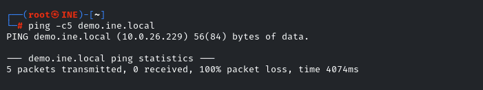

- The target is reachable (If you look at the Window Recon Lab the result is blocked by window firewall)

### Step 2

- Peform default Nmap scan

```bash
nmap demo.ine.local
```

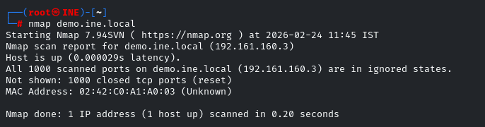

> The defalut Nmap Scan does not reveal any ports because the defalut Nmap scan only scans 1000 of commonly used ports.

- In order to get an accurate idea of the open ports on the target system
  - Scan the entire TCP port (65,535)
  - `nmap demo.ine.local -p-`

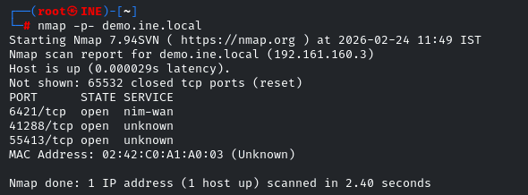

- The result is port 6421, 41288, 55413 are open

### Step 3

- Identified the open ports on the targe by running the following command

```bash
nmap -p 6421,41288,55413 -sV demo.ine.local
```

- It revals the sevice name and version of an Opening Port

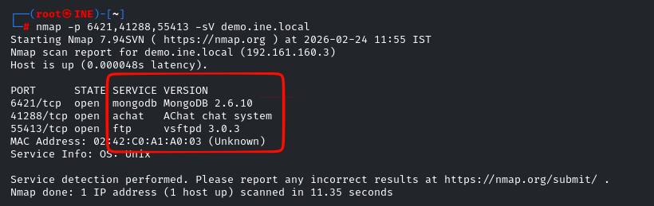

## Scan Server II

### Objective

- Scan and detect open ports and services used by Bind DNS, TFTP (Trivial File Transfer Protocol) and SNMP (Simple Network Management Protocol) servers on target network

### Step 1 (All TCP Port Scanning)

- Scan all the TCP port that are open

```bash
nmap -p- demo.ine.local
```

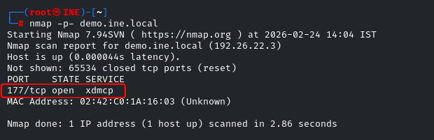

- Port 177/tcp (xdmcp) is open
- It is Remote Desktop GUI for Linux

### Step 2 (Identify TCP Version)

- Use the flag `-A` to Enable OS detection, version detection, script scanning, and traceroute

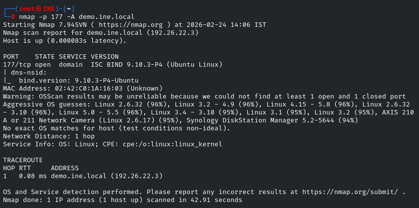

- In the screenshot, the DNS BIND server is running on port 177.

### Step 3 (Scan For UDP Port)

- Find UDP port that are open (I use `-T5` because the other command is too slow as it shown on the picture)

```bash
nmap -T5 -sU demo.ine.local
```

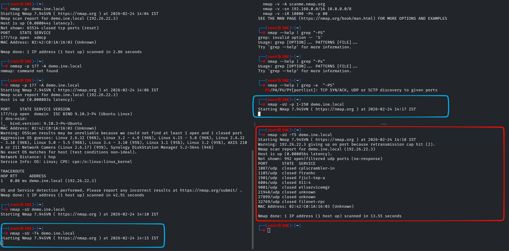

- All th port are close maybe it is too fast.

### Step 4 (Specify UDP Port Version and Scope amount of port scan)

```bash
nmap -p1-100 -sUV demo.ine.local
```

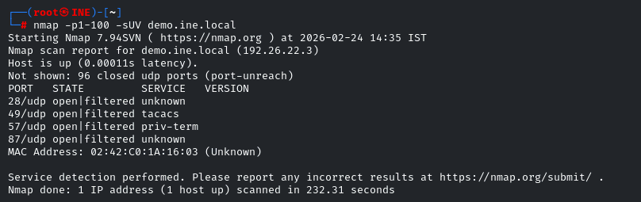

- None of the port are open

```bash
nmap -p101-199 -sUV demo.ine.local
```

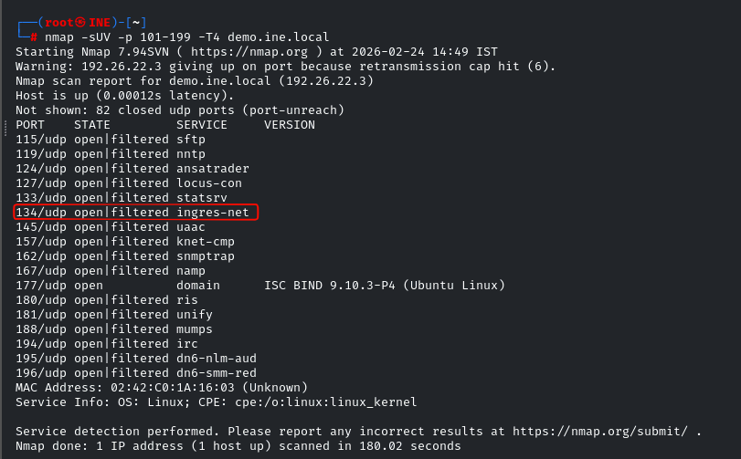

- Port 134 is open (INGRESS-NET) , It is a Relational Database Management System in the very old version

```bash
nmap -p2-250 -sUV demo.ine.local
```

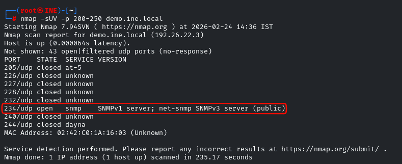

- Port 234/udp (snmp) is open
- It is a protocol to mange Router Switch or Server on the System

### Step 5 ( Connect to the server)

```bash
tftp demo.ine.local
```

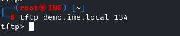
