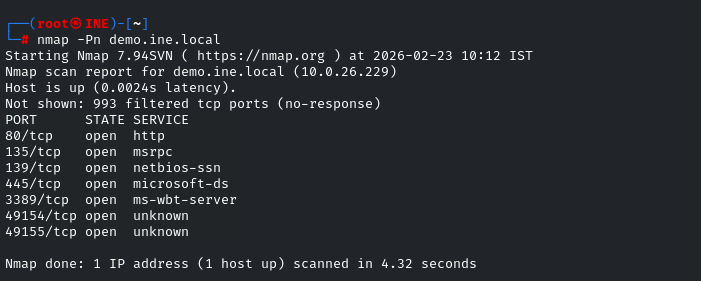
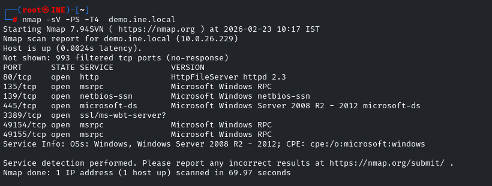

# Windows Recon: Nmap Host Discovery

## Step 1 (Ping Machine)

- Ping the target machine to check if it is alive or not.

```bash
ping -c 5 demo.ine.local
```


- The target is not responding so we cannot comfirm that it is alive or down (Window server firewall usually block ICMP Ping)

## Step 2 (Scan Alive Port)

```bash
nmap -Pn demo.ine.local
```

- Skip host discovery and scan all alive ports
- We can now see multiple ports that are open on the machine



## Step 3 (Discover version)

- Determine the application version information

```bash
nmap -sV -T4 demo.ine.local
```


