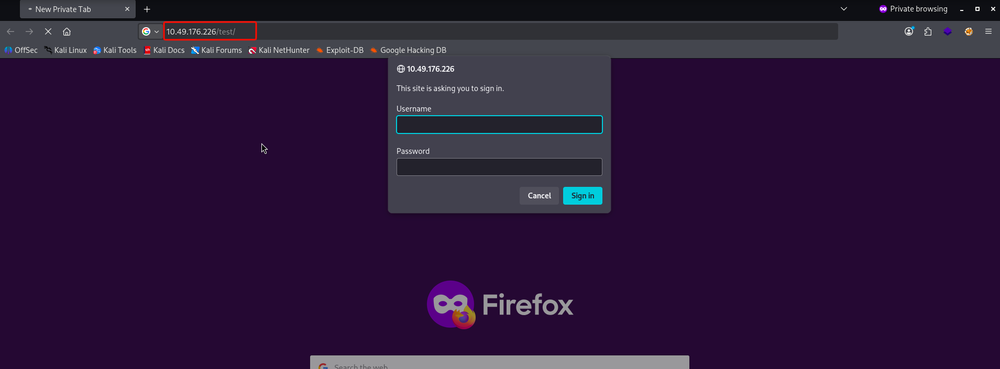
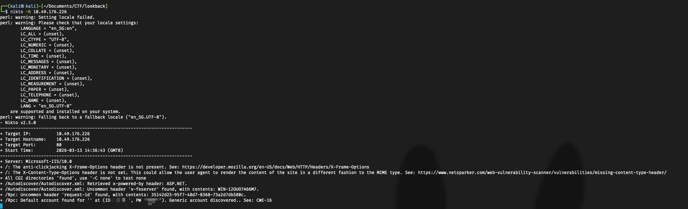
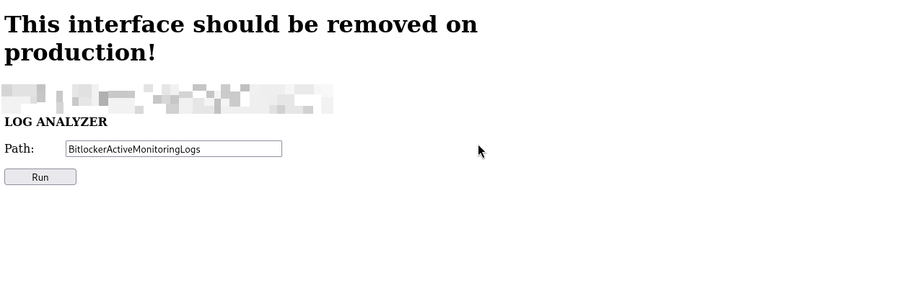
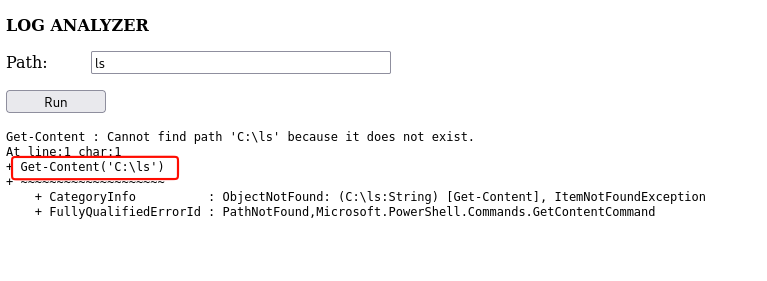
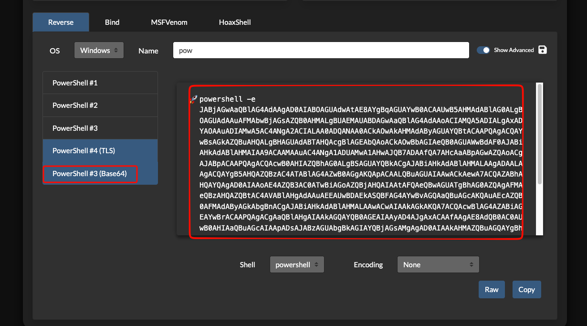
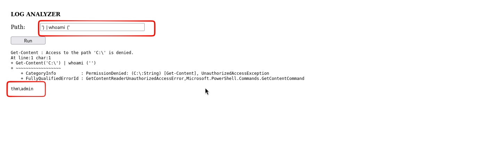
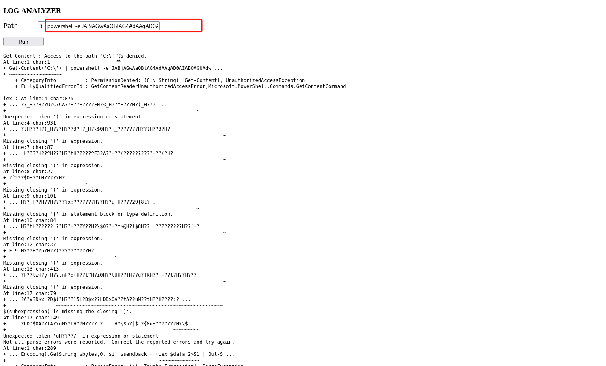
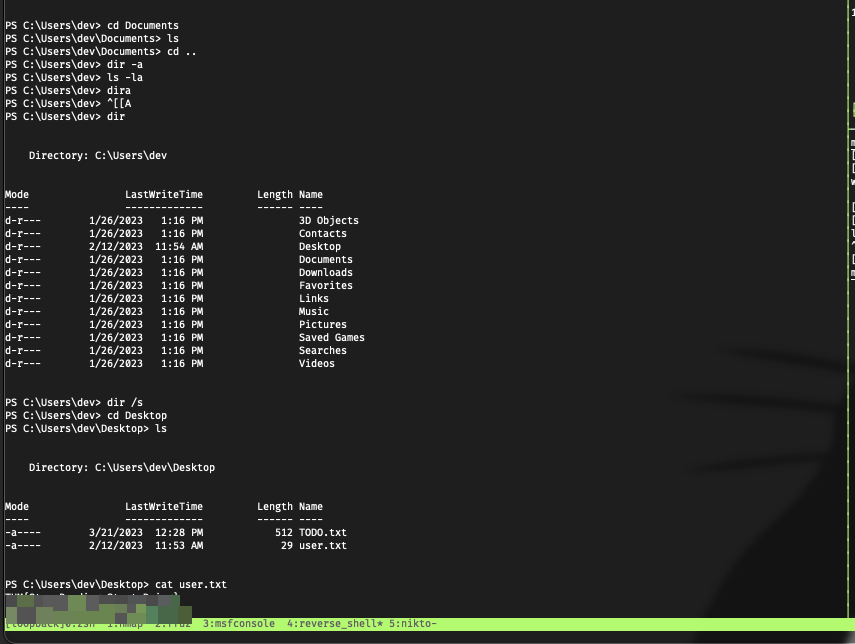
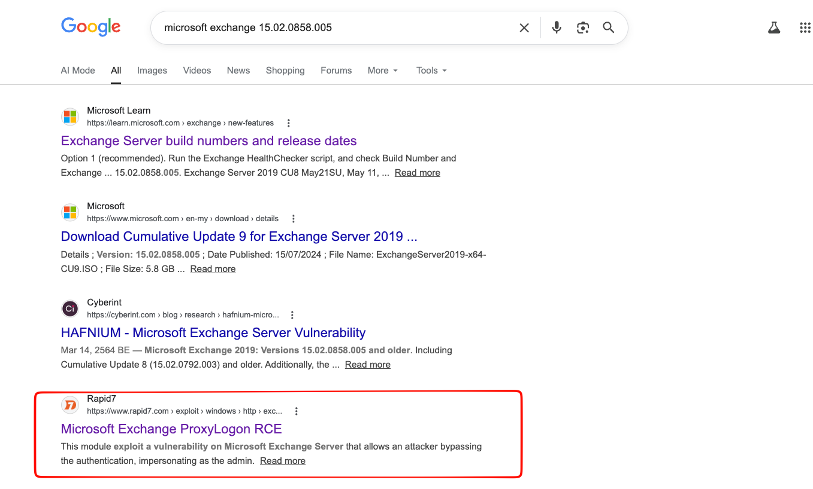
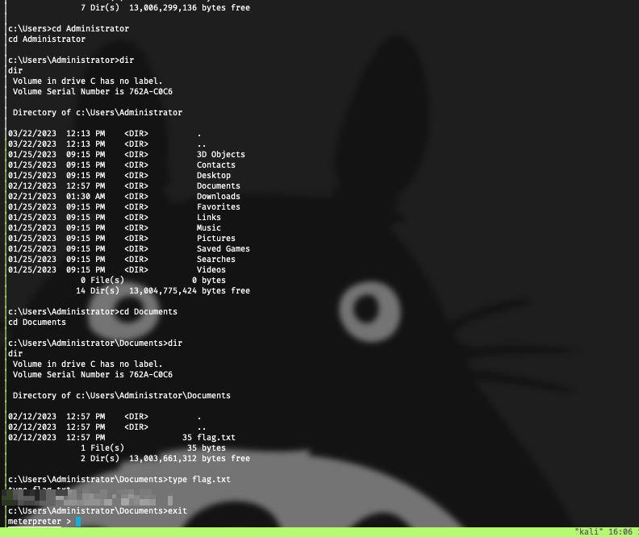

# Loopback

## Step1: Enumeration

```txt
# Nmap 7.98 scan initiated Fri Mar 13 12:59:58 2026 as: /usr/lib/nmap/nmap --privileged -sS -sV -sC -oN lookback_nmap.txt 10.49.157.205
Nmap scan report for 10.49.157.205
Host is up (0.27s latency).
Not shown: 997 filtered tcp ports (no-response)
PORT     STATE SERVICE       VERSION
80/tcp   open  http          Microsoft IIS httpd 10.0
|_http-server-header: Microsoft-IIS/10.0
|_http-title: Site doesn't have a title.
443/tcp  open  https?
| ssl-cert: Subject: commonName=WIN-12OUO7A66M7
| Subject Alternative Name: DNS:WIN-12OUO7A66M7, DNS:WIN-12OUO7A66M7.thm.local
| Not valid before: 2023-01-25T21:34:02
|_Not valid after:  2028-01-25T21:34:02
3389/tcp open  ms-wbt-server Microsoft Terminal Services
| ssl-cert: Subject: commonName=WIN-12OUO7A66M7.thm.local
| Not valid before: 2026-03-12T04:53:27
|_Not valid after:  2026-09-11T04:53:27
Service Info: OS: Windows; CPE: cpe:/o:microsoft:windows

Service detection performed. Please report any incorrect results at https://nmap.org/submit/ .
# Nmap done at Fri Mar 13 13:01:21 2026 -- 1 IP address (1 host up) scanned in 82.99 seconds
```

### Information

- DNS: `WIN-12OUO7A66M7.thm.local`
  - Add this DNS record to your `/etc/hosts` file to resolve the domain.
- Port: `3389/tcp` (ms-wbt-server - Microsoft Terminal Services)
  - This indicates a Windows-Based Terminal Server is running for Remote Desktop Protocol (RDP).

## Step2: Ffuf (Web Directory Fuzzing)

Since ports 80 (HTTP) and 443 (HTTPS) are open, we can assume a web application is being hosted. We use `ffuf` (Fuzz Faster U Fool) to brute-force and uncover hidden web directories.

```text

┌──(kali㉿kali)-[~/Documents/CTF/lookback]
└─$ ffuf -u https://WIN-12OUO7A66M7.thm.local/FUZZ -w /usr/share/wordlists/dirbuster/directory-list-2.3-medium.txt -t 50 -fs 0

        /'___\  /'___\           /'___\
       /\ \__/ /\ \__/  __  __  /\ \__/
       \ \ ,__\\ \ ,__\/\ \/\ \ \ \ ,__\
        \ \ \_/ \ \ \_/\ \ \_\ \ \ \ \_/
         \ \_\   \ \_\  \ \____/  \ \_\
          \/_/    \/_/   \/___/    \/_/

       v2.1.0-dev
________________________________________________

 :: Method           : GET
 :: URL              : https://WIN-12OUO7A66M7.thm.local/FUZZ
 :: Wordlist         : FUZZ: /usr/share/wordlists/dirbuster/directory-list-2.3-medium.txt
 :: Follow redirects : false
 :: Calibration      : false
 :: Timeout          : 10
 :: Threads          : 50
 :: Matcher          : Response status: 200-299,301,302,307,401,403,405,500
 :: Filter           : Response size: 0
________________________________________________

test                    [Status: 401, Size: 1293, Words: 81, Lines: 30, Duration: 159ms]
Test                    [Status: 401, Size: 1293, Words: 81, Lines: 30, Duration: 159ms]
owa                     [Status: 302, Size: 233, Words: 6, Lines: 4, Duration: 160ms]
ecp                     [Status: 302, Size: 233, Words: 6, Lines: 4, Duration: 207ms]
27079%5Fclassicpeople2%2Ejpg [Status: 302, Size: 146, Words: 6, Lines: 4, Duration: 168ms]
tiki%2Epng              [Status: 302, Size: 130, Words: 6, Lines: 4, Duration: 176ms]
squishdot_rss10%2Etxt   [Status: 302, Size: 141, Words: 6, Lines: 4, Duration: 193ms]
b33p%2Ehtml             [Status: 302, Size: 131, Words: 6, Lines: 4, Duration: 167ms]
:: Progress: [220560/220560] :: Job [1/1] :: 281 req/sec :: Duration: [0:13:23] :: Errors: 0 ::
```

- The `ffuf` scan reveals interesting directories like `/owa` (Outlook Web App) and `/ecp` (Exchange Control Panel). Finding these directories is a strong indicator that a Microsoft Exchange Server is running on this machine.

- We navigate to the web application's login page and attempt basic access.
- Let's try logging in using default credentials:
  - Username: `admin`
  - Password: `admin`



- While tools like Nikto can be used for further vulnerability enumeration, in this scenario, simply guessing the default username and password successfully gave us immediate entry.





## Step3: Reverse Shell Using Netcat

- Through manual testing of the web application's inputs, we identified a command injection vulnerability. This flaw allows us to execute arbitrary system commands on the server, which we can leverage to establish a reverse shell.
  

- Head over to `https://www.revshells.com/` to easily generate a reverse shell payload suited for our listener.
  
- Modify the web application request to inject our newly created reverse shell payload.
  
- Once the crafted payload is injected and executed by the server, our netcat listener will catch the incoming connection.
  
  

> You can find the flag on Desktop

## Step4: Privilege Escalation

Further valuable information can be found lying around on the Desktop in a file named `TODO.txt`.

```txt
PS C:\Users\dev\Desktop> cat TODO.txt
Hey dev team,

This is the tasks list for the deadline:

Promote Server to Domain Controller [DONE]
Setup Microsoft Exchange [DONE]
Setup IIS [DONE]
Remove the log analyzer[TO BE DONE]
Add all the users from the infra department [TO BE DONE]
Install the Security Update for MS Exchange [TO BE DONE]
Setup LAPS [TO BE DONE]


When you are done with the tasks please send an email to:

joe@thm.local
carol@thm.local
and do not forget to put in CC the infra team!
dev-infrastracture-team@thm.local
```

```txt
# Emails discovered in TODO.txt
joe@thm.local
carol@thm.local
dev-infrastracture-team@thm.local
```

> "Install the Security Update for MS Exchange [TO BE DONE]"
> This task stands out because it implies the Microsoft Exchange server is missing critical security patches. If it's outdated, it's highly likely to be vulnerable to well-known exploits.

> Note: Microsoft Exchange is an enterprise-grade mail server and calendaring software developed by Microsoft.

- We can cross-reference the server's build numbers with official Microsoft documentation to pinpoint its exact version: [Exchange Server Build Numbers and Release Dates](https://learn.microsoft.com/en-us/exchange/new-features/build-numbers-and-release-dates)

```powershell
Get-Command Exsetup.exe | ForEach-Object {$_.FileVersionInfo}
```

```txt
ProductVersion   FileVersion      FileName
--------------   -----------      --------
15.02.0858.005   15.02.0858.005   C:\Program Files\Microsoft\Exchange Server\V15\bin\ExSetup.exe
```

- By searching for this specific `ProductVersion` (15.02.0858.005), we uncover that it is severely outdated and vulnerable to **ProxyShell** (CVE-2021-34473, CVE-2021-34523, CVE-2021-31207).
- ProxyShell is an exploit chain that bypasses authentication and executes arbitrary commands, granting us an elevated shell as `NT AUTHORITY\SYSTEM`.



- Fire up Metasploit and use the corresponding exploit module to obtain SYSTEM privileges:
- `use exploit/windows/http/exchange_proxyshell_rce`


