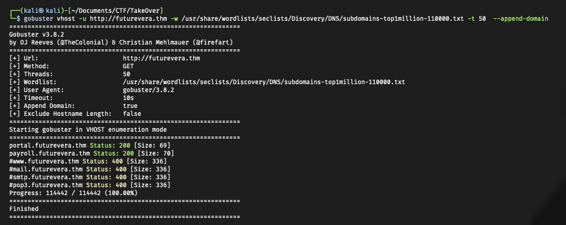
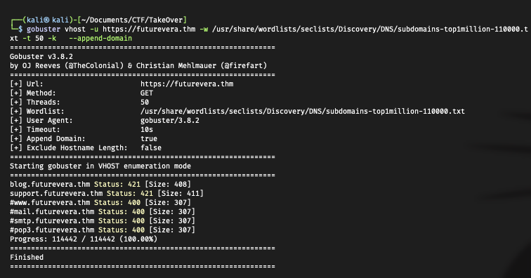
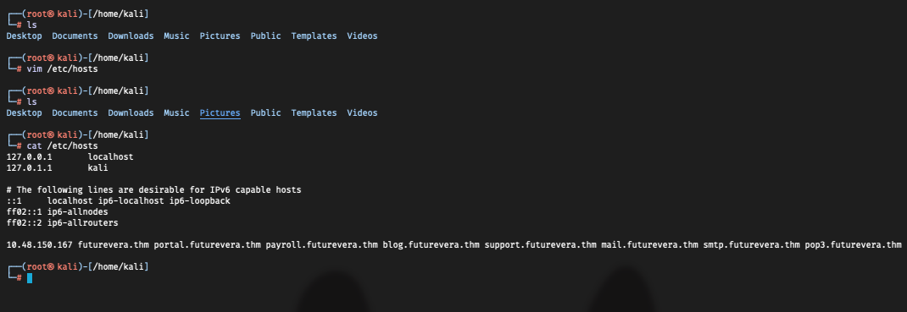
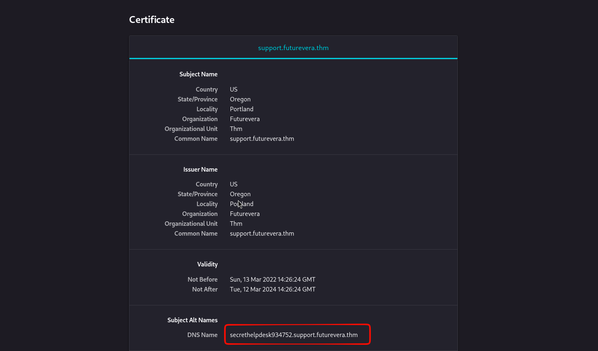
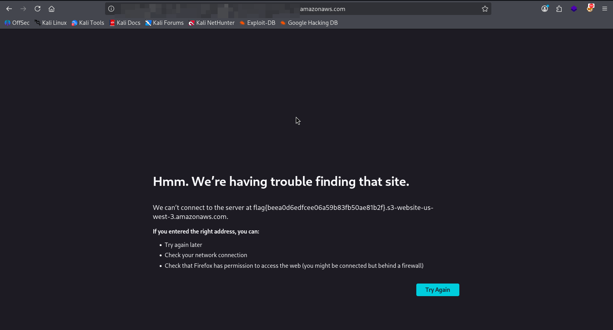

# Take Over

> This challenge focuses on Subdomain Enumeration and Virtual Host (VHost) Discovery to find hidden entry points.

## Step 1 : Port Scanning

```bash
nmap -sS -sV -sC 10.48.150.167
```

```txt
└─$ nmap -sS -sV -sC 10.48.150.167
Starting Nmap 7.98 ( https://nmap.org ) at 2026-03-11 13:50 +0800
Nmap scan report for futurevera.thm (10.48.150.167)
Host is up (0.16s latency).
Not shown: 997 closed tcp ports (reset)
PORT    STATE SERVICE  VERSION
22/tcp  open  ssh      OpenSSH 8.2p1 Ubuntu 4ubuntu0.13 (Ubuntu Linux; protocol 2.0)
| ssh-hostkey:
|   3072 ba:86:0e:05:c8:52:e0:62:79:5e:93:2e:22:17:85:50 (RSA)
|   256 4c:f2:78:f4:53:18:ac:ef:9c:87:ec:52:20:9d:71:6d (ECDSA)
|_  256 69:69:b8:08:f1:57:4e:a7:1f:e9:1e:2c:5c:dd:06:43 (ED25519)
80/tcp  open  http     Apache httpd 2.4.41 ((Ubuntu))
|_http-title: Did not follow redirect to https://futurevera.thm/
|_http-server-header: Apache/2.4.41 (Ubuntu)
443/tcp open  ssl/http Apache httpd 2.4.41 ((Ubuntu))
|_ssl-date: TLS randomness does not represent time
|_http-server-header: Apache/2.4.41 (Ubuntu)
| ssl-cert: Subject: commonName=futurevera.thm/organizationName=Futurevera/stateOrProvinceName=Oregon/countryName=US
| Not valid before: 2022-03-13T10:05:19
|_Not valid after:  2023-03-13T10:05:19
|_http-title: FutureVera
| tls-alpn:
|_  http/1.1A
Service Info: OS: Linux; CPE: cpe:/o:linux:linux_kernel

Service detection performed. Please report any incorrect results at https://nmap.org/submit/ .
Nmap done: 1 IP address (1 host up) scanned in 24.24 seconds
```

### Analysis

- The scan reveals three open ports:
  - 22 (SSH): OpenSSH 8.2p1.
  - 80 (HTTP): Apache 2.4.41; redirects to `https://futurevera.thm/`
  - 443 (HTTPS): Apache 2.4.41; hosting the "FutureVera" site.

Note: Since the site redirects to futurevera.thm, we must add this domain to our /etc/hosts file to access it via the browser.

## Step 2 : Subdomain Enumeration

- With the main domain identified, we use Gobuster in vhost mode to discover subdomains. This is crucial because some subdomains may only be accessible via specific protocols or might be hidden behind a Virtual Host configuration.

```bash
gobuster vhost -u http://futurevera.thm -w /usr/share/wordlists/seclists/Discovery/DNS/subdomains-top1million-110000.txt -t 50  --append-domain
```

- This initial scan identified two subdomains:
  - portal.futurevera.thm
  - payroll.futurevera.thm



- HTTPS Enumeration
  - By repeating the scan on `https://futurevera.thm`, we can often find additional subdomains that require SSL/TLS.



## Step 3 : Updating Host File

- To allow our browser and tools to resolve these new subdomains, we add them to the /etc/hosts file on our local machine

```bash
10.48.150.167 futurevera.thm portal.futurevera.thm payroll.futurevera.thm blog.futurevera.thm support.futurevera.thm www.futurevera.thm mail.futurevera.thm smtp.futurevera.thm pop3.futurevera.thm
```



## Step 4: Investigating SSL Certificates

- A common trick in CTFs is hiding sensitive subdomains within the Subject Alternative Name (SAN) or the Common Name (CN) of an SSL certificate.
- I inspected the certificates for each discovered subdomain. While checking support.futurevera.thm, I found a highly suspicious entry:

### Interesting Discovery:

- The certificate for the support subdomain contained an unusual DNS name:
  - `secrethelpdesk934752.support.futurevera.thm`



- Navigating to this URL in the browser revealed the hidden flag.


