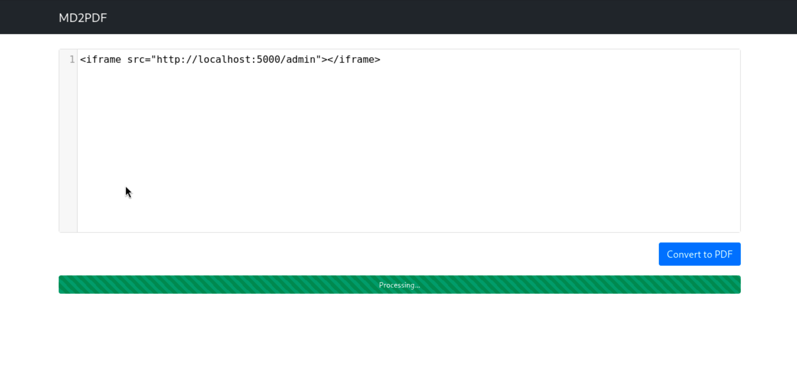

# MD2PDF

## Objective

This room focuses on exploiting a **Server-Side Request Forgery (SSRF)** vulnerability combined with **Cross-Site Scripting (XSS)** techniques.

## Enumeration

### Port Scanning

Perform an Nmap scan to identify open ports and services:

```bash
nmap -sS -sV 10.48.184.151
```

**Results:**

```bash
Nmap 7.98 scan initiated Wed Mar 18 00:27:00 2026 as: /usr/lib/nmap/nmap --privileged -sS -sV -oN md2pdf.txt 10.48.184.151
...
Nmap scan report for 10.48.184.151 (10.48.184.151)
Host is up (0.11s latency).
Not shown: 997 closed tcp ports (reset)
PORT     STATE SERVICE VERSION
22/tcp   open  ssh     OpenSSH 8.2p1 Ubuntu 4ubuntu0.5 (Ubuntu Linux; protocol 2.0)
80/tcp   open  rtsp
5000/tcp open  rtsp
```

### Directory Fuzzing

Use `ffuf` to discover hidden directories on the web server running on port 80:

```bash
ffuf -u http://10.48.184.151/FUZZ -w /usr/share/wordlists/dirbuster/directory-list-2.3-small.txt
```

**Results:**

```bash
admin                   [Status: 403, Size: 166, Words: 15, Lines: 5, Duration: 123ms]
convert                 [Status: 405, Size: 178, Words: 20, Lines: 5, Duration: 125ms]
```

We found two interesting endpoints:

- `/admin`: Returns a `403 Forbidden` status code, indicating that external access is blocked.
- `/convert`: Returns a `405 Method Not Allowed`, which suggests this endpoint might expect a specific HTTP method (like POST).

## Exploitation

Since I encountered a `403 Forbidden` error when trying to access `/admin` externally, it likely means the page is only accessible from the localhost (the server itself). We can attempt an SSRF attack to bypass this restriction by making the server request the page on our behalf.

The application converts Markdown to PDF. We can inject an HTML `iframe` tag into the Markdown input to force the server to render the local admin page inside the PDF.

### Payload

```html
<iframe src="http://localhost:5000/admin"></iframe>
```

### Why does this work?

- **The Restriction:** If you try to visit `http://10.48.184.151:5000/admin` directly from your machine, the server checks your IP address and blocks the request (`403 Forbidden`), as it only allows access from internal users (e.g., `127.0.0.1` or `localhost`).
- **The Bypass (SSRF):** By embedding the `iframe` payload into the Markdown converter, the server processes the HTML and fetches the content of `http://localhost:5000/admin`. Since the request originates from the server itself, the access control check passes, and the content of the `/admin` page is included in the generated PDF.

### Executing the Attack

1. Enter the payload into the Markdown editor on the main page.
2. Click the button to convert the Markdown to a PDF document.



Upon processing, the server will fetch the restricted administrative page and render its output in the resulting PDF, revealing the hidden flag


